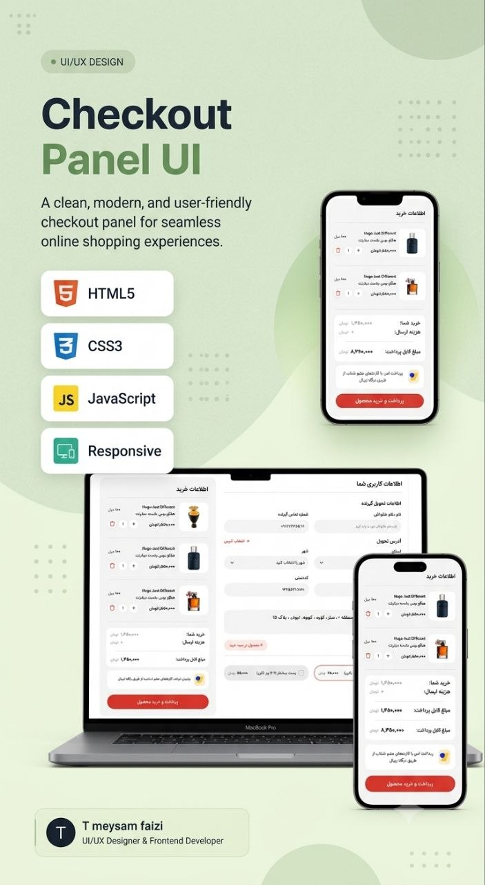

# Checkout Panel UI

<p align="center">
  
</p>

---

## Project Links & Badges

[](https://meysamfaizi.github.io/Botcamp-Task3/)
[](https://github.com/meysamfaizi/Botcamp-Task3)
[](https://opensource.org/licenses/MIT)
[](#author)
[](#built-with)

---

## Overview

A clean, modern, and user-friendly **checkout panel** (`اطلاعات خرید`) for a Persian (RTL) e-commerce store. The panel shows the cart items with quantity controls, an order summary with shipping and total, a secure payment gateway note, and a delivery-information form (recipient, address, shipping method) — all in a fully responsive, mobile-first layout.

## The challenge

- Display cart items (`اطلاعات خرید`) with product image, English/Persian name, volume, and price
- Increase item quantity or remove an item from the cart
- Show an order summary: items total, shipping cost, and final payable amount
- Display a secure-payment note referencing the Zibal payment gateway
- Collect recipient delivery information (full name, phone number)
- Select province and city from dropdown menus
- Enter address, plaque number, and postal code
- Choose a shipping method (Tipax insured / Post Pishtaz) with its price
- Show the number of items in the cart as a badge next to the shipping options
- Make the whole panel responsive across mobile, tablet, and desktop breakpoints

## Built with

- Semantic HTML5
- CSS3 — CSS Grid & Flexbox, CSS Custom Properties (design tokens in `:root`)
- Mobile-first responsive workflow (breakpoints at `500px`, `1000px`, `1024px`)
- RTL (right-to-left) layout for Persian content
- Custom `@font-face` — IRAN Yekan (Regular & Bold)
- Inline SVG icons (delete icon, secure-payment badge)

---

## Screenshots

The panel adapts across breakpoints:

| Device               | View                                                                             |
| -------------------- | -------------------------------------------------------------------------------- |
| 📱 Mobile            | Single-column layout — cart, order summary, and delivery form stacked vertically |
| 💻 Desktop (≥1024px) | Two-column layout — cart & payment on one side, delivery form on the other       |

---

## Project Structure

```
Botcamp-Task3/
├── asset/
│   ├── image/          # Product images (PNG)
│   └── fonts/
│       ├── IRANYekanRegular.ttf
│       └── IRANYekanBold.ttf
├── src/
│   ├── style.css       # Reset, design tokens, layout, components, media queries
│   └── font.css        # @font-face declarations (IRAN Yekan)
├── index.html
├── Preview.jpg
└── README.md
```

---

## Features

- 🛒 Cart items with quantity increase and remove controls
- 💰 Order summary — items total, shipping cost, and total payable amount
- 🔒 Secure payment note (Zibal gateway) with SVG badge
- 📦 Delivery form — recipient name, phone, province, city, plaque, postal code, full address
- 🚚 Shipping method selection with live pricing (Tipax / Post Pishtaz)
- 🏷️ Cart-count badge shown alongside shipping options
- 📱 Fully responsive, mobile-first, RTL layout
- 🎨 Centralized design tokens via CSS custom properties for easy re-theming

---

## Getting Started

1. Clone the repository

```bash
git clone https://github.com/meysamfaizi/Botcamp-Task3.git
```

2. Open `index.html` directly in your browser — no build step, package manager, or dependencies required.

---

## Continued Development

- [ ] Add real cart logic in JavaScript (quantity, remove, totals updating dynamically)
- [ ] Add client-side form validation and error states for the delivery form
- [ ] Wire up province → city dependent dropdowns
- [ ] Improve accessibility (ARIA roles, keyboard navigation, focus states)
- [ ] Add a confirmation/success step after payment
- [ ] Add automated tests for price and shipping calculations

---

## Useful Resources

- [MDN: CSS Grid Layout](https://developer.mozilla.org/en-US/docs/Web/CSS/CSS_Grid_Layout)
- [CSS-Tricks: A Complete Guide to Flexbox](https://css-tricks.com/snippets/css/a-guide-to-flexbox/)
- [web.dev: Responsive Web Design](https://web.dev/learn/design/)
- [MDN: CSS Custom Properties](https://developer.mozilla.org/en-US/docs/Web/CSS/Using_CSS_custom_properties)
- [MDN: RTL Styling / Logical Properties](https://developer.mozilla.org/en-US/docs/Web/CSS/CSS_Logical_Properties_and_Values)

---

## Author

**Meysam Faizi** — UI/UX Designer & Frontend Developer

- GitHub: [meysamfaizi](https://github.com/meysamfaizi)
- LinkedIn: [profile](https://www.linkedin.com/)

---

## License

This project is licensed under the [MIT License](https://opensource.org/licenses/MIT).
